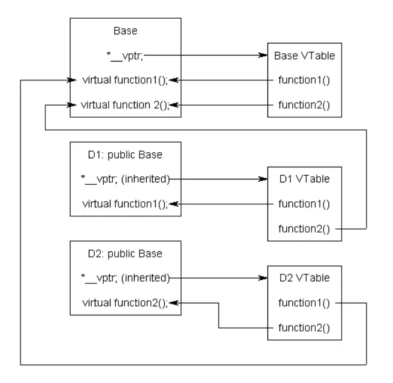

# Virtual trong C++
- Sử dụng cho các trường hợp:
    + Đa hình
    + Ghi đè hàm (Override)
    + Hàm ảo thuần túy (pure method) - Lớp trừu tượng (Abstract class)
- Khi 1 hàm được khai báo là virtual, hàm này sẽ gọi theo loại đối tượng được trỏ (hoặc tham chiếu) chứ không phải loại con trỏ (hoặc tham chiếu).
VD:
```cpp
class Base {
    virtual void func1() {
        cout << "func1 Base class\n";
    } 
    virtual void func2() {
        cout << "func2 Base class\n";
    }
};

class Derived1 : public Base {
    virtual void func1() override {
        cout << "func1 Derived class\n";
    }
};

int main() {
    Base *bptr = new Derived1();
    bptr->func1(); // func1 Derived class
    bptr->func2(); // func2 Base class
}
```
## Vtable - Virtual table hay Virtual function table
- Là bảng ảo, thường được sử dụng để quản lý các bảng ảo
- vtable chứa địa chỉ của các hàm ảo, cho phép thực hiện các lệnh gọi hàm chính xác 
## vptr - virtual pointer
- Khi một lớp chứa 1 phương thức được khai báo là ảo (virtual), thì khi khai báo mỗi đối tượng của lớp đó sẽ có 1 con trỏ vptr trỏ đến vtable của lớp đó



## Giải thích
- Khi tạo 1 đối tượng kiểu Derived1, con trỏ vptr (Inherited - kế thừa) được tạo, trỏ đến bảng vtable của Derived1. 
- vtable của D1 bao gồm func1(được khai báo trong lớp cha Base và ghi đè trong lớp con D1) và func2(trong lớp cha)
- Khi bptr gọi hàm func1, do hàm này đã được ghi đè trong D1 nên nó sẽ gọi đến hàm func1 ở lớp con
- Khi gọi func2, hàm này không được ghi đè trong lớp con nên nó sẽ gọi đến hàm func2 ở lớp cha Base